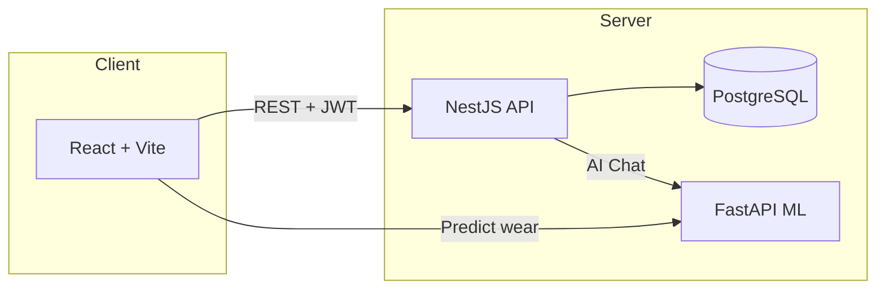
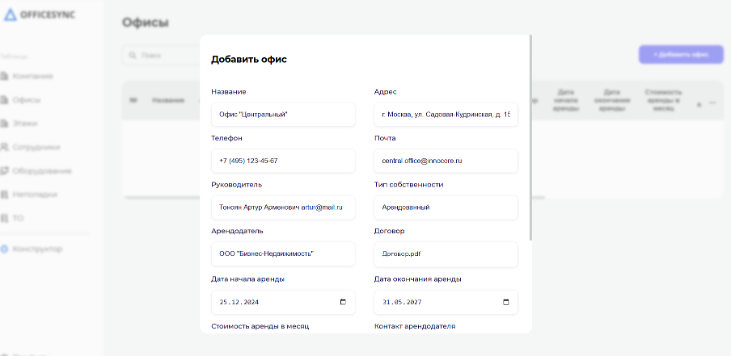
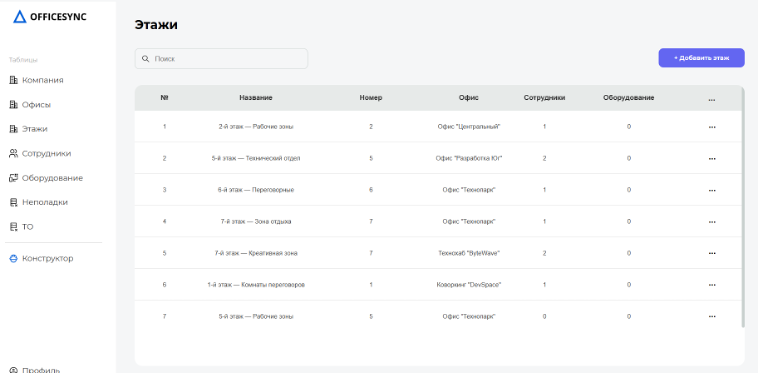
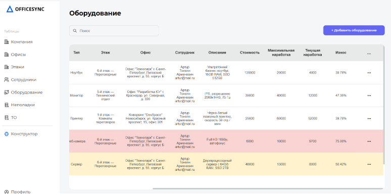
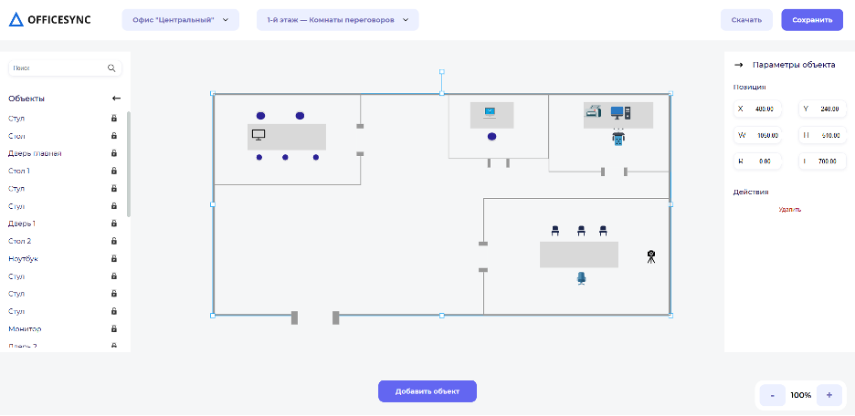
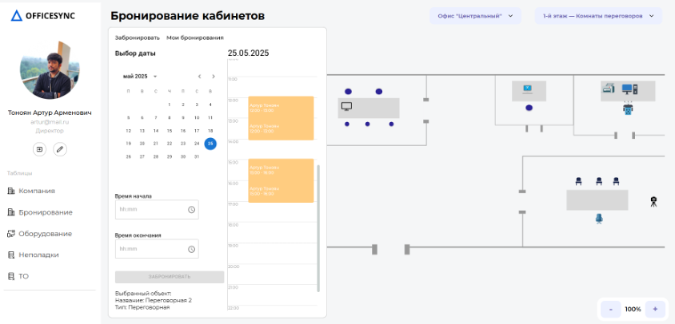

<div align="center">

# OfficeSync

**Платформа для управления офисом, оборудованием и интерактивными планами этажей**

[](https://react.dev/)
[](https://www.typescriptlang.org/)
[](https://vitejs.dev/)
[](https://nestjs.com/)
[](https://fastapi.tiangolo.com/)

*Учёт сотрудников · мониторинг оборудования · визуальный конструктор офиса · AI-аналитика*

</div>

---

## О проекте

**OfficeSync** — fullstack-платформа для компаний, которым нужен единый инструмент управления офисной инфраструктурой. Система объединяет административную панель, личный кабинет сотрудника, интерактивный редактор планов этажей и ML-модуль прогнозирования износа оборудования.

---

## Ключевые возможности

| Модуль | Описание |
|--------|----------|
| **Админ-панель** | Управление компанией, офисами, этажами, сотрудниками и ролями |
| **Оборудование** | CRUD оборудования, гарантийные сроки, учёт неисправностей и ТО |
| **Конструктор** | Drag-and-drop редактор плана этажа на базе Konva.js |
| **Бронирование** | Резервирование рабочих мест и переговорных комнат |
| **Аналитика** | Интерактивные графики ECharts: 2D, 3D и donut-диаграммы |
| **AI-чат** | Ассистент для вопросов по офисной инфраструктуре |
| **ML-прогноз** | Предсказание износа оборудования через FastAPI-сервис |

---

## Архитектура

```
officesync/
├── frontend/     → React 19 + TypeScript + Vite
├── backend/      → NestJS + PostgreSQL + Sequelize
└── neiroset/     → FastAPI + ML-модель прогноза износа
```



---

## Технологический стек

### Frontend
- React 19, TypeScript, Vite 6
- Redux Toolkit, TanStack Query, React Router 7
- Konva, ECharts, MUI, Framer Motion
- Sentry — мониторинг ошибок

### Backend
- NestJS 10, PostgreSQL, Sequelize
- JWT-аутентификация, Multer

### ML-сервис
- FastAPI, Python — прогноз износа оборудования

---

## Быстрый старт

### Требования

- Node.js 20+
- PostgreSQL
- Python 3.10+ (для ML-сервиса)

### Backend

```bash
cd backend
npm install
npm run dev
# http://localhost:3004
```

### Frontend

```bash
cd frontend
npm install
cp .env.example .env
npm run dev
# http://localhost:3000
```

### ML-сервис (опционально)

```bash
cd neiroset
python -m venv .venv
source .venv/bin/activate
pip install -r requirements.txt
python -m uvicorn src.main:app --reload --port 3014
```

---

## Переменные окружения

`frontend/.env`:

```env
VITE_API_URL=http://localhost:3004
VITE_NEIRO_URL=http://localhost:3014
VITE_SENTRY_DSN=
VITE_SENTRY_TRACES_SAMPLE_RATE=0.1
VITE_ENABLE_CLIENT_LOGS=true
```

---

## Скрипты frontend

| Команда | Описание |
|---------|----------|
| `npm run dev` | Dev-сервер Vite |
| `npm run build` | Production-сборка |
| `npm run preview` | Просмотр сборки |
| `npm run typecheck` | Проверка типов |

---

## Структура frontend

```
frontend/src/
├── api/              # Axios-клиент и API-запросы
├── modules/          # Переиспользуемые UI-модули
├── pages/
│   ├── Admin/        # Админ-панель
│   ├── Constructor/  # Редактор планов этажей
│   ├── Profile/      # Личный кабинет
│   └── entrance/     # Авторизация и регистрация
├── store/            # Redux slices
├── hooks/            # Custom React hooks
├── utils/            # Утилиты и валидация
└── monitoring/       # Sentry
```

---

## Скриншоты

### Главная страница
Лендинг с описанием продукта и ключевых преимуществ.

<p align="center">
  
</p>

### Админ-панель

**Офисы** — управление офисами компании с полной информацией об аренде и контактах.

<p align="center">
  
</p>

**Этажи** — таблица этажей с привязкой к офисам, сотрудникам и оборудованию.

<p align="center">
  
</p>

**Оборудование** — учёт техники с отслеживанием наработки, износа и привязкой к сотрудникам.

<p align="center">
  
</p>

### Конструктор планов
Drag-and-drop редактор этажа на canvas — расстановка мебели, техники и объектов офиса.

<p align="center">
  
</p>

### Бронирование
Бронирование переговорных комнат с календарём, таймлайном и интерактивной картой этажа.

<p align="center">
  
</p>

---

<div align="center">

**OfficeSync** — управление офисом на новом уровне

</div>
